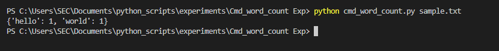

# command-line-arguments-to-count-word
## AIM:
To write a python program for getting the word count from the contents of a file using command line arguments.
## EQUIPEMENT'S REQUIRED: 
PC
Anaconda - Python 3.7
## ALGORITHM: 
### Step 1:
import os

## Step 2: 
Open file using open().

## Step 3:
 Use for loop

## Step 4: 
Use len to count number of words.

## Step 5:
 Give print.

## Step 6: 
End of the program


## PROGRAM:
```
#Developed by:Ashwin Kumar.S
#Reference number:22000974

import sys
count = {}
with open(sys.argv[1], 'r') as f:
    for line in f:
        for word in line.split():
            if word not in count:
                count[word] = 1
            else:
                count[word] += 1
print(count)
f.close()
```

### OUTPUT:



## RESULT:
Thus the program is written to find the word count from the contents of a file using command line arguments.
